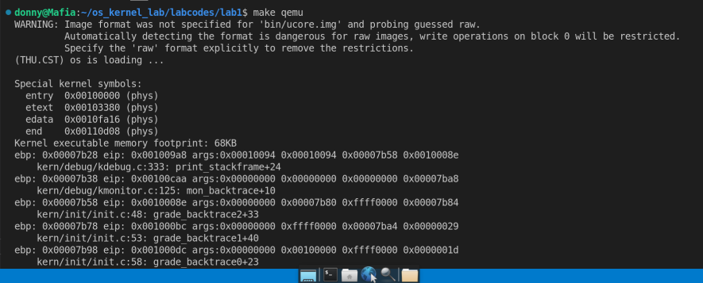

# Lab0-Lab1实验报告

**一、实验目的**

*Lab0：*

1. 了解操作系统开发实验环境

2. 熟悉命令行方式的编译、调试工程

3. 掌握基于硬件模拟器的调试技术

4. 熟悉C语言编程和指针的概念

5. 了解X86汇编语言

*Lab1：*

* 我们需要完成一个能够切换到x86的保护模式并显示字符的bootloader，为启动操作系统ucore做准备。lab1提供了一个非常小的bootloader和ucore OS，整个bootloader执行代码小于512个字节，这样才能放到硬盘的主引导扇区中。
  


**二、实验过程**

*问题1：*

* 实验中遇到的第1个问题是Lab0中配置硬件模拟器Qemu，我使用的Linux环境是WSL2，为了方便我直接在Windows下用VSCode远程连接，但是在make qemu时发生以下报错：

```
    gtk initialization failed
```

* 类似的gtk初始化失败的错误在网上能找到很多，但是都与我的情况不符，我试着运行qemu，发现仍然报错，但警告没有了，因此问题在于qemu，与项目无关。
后来我查到，gtk是是一种GUI工具包，它支持创建基于 GUI 的应用程序。由于WSL2不含GUI，就自然没有gtk可以初始化。

*解决方法：*

* 我用xubantu为WSL2配置了图形化界面，就可以正常make qemu了



*问题2：*

在运行make qemu指令的时候还会报错

```
qemu-system-i386:Could not open 'bin/ucore.img': Permission denied
```

* 原因很简单，就是我在git clone的时候是以root身份执行的，因此文件夹对于普通用户只有读权限，通过chmod -R 777 os_kernel_lab指令即可赋予普通用户读写与执行权限。

*源码链接：https://github.com/Donnykk/OS_Lab*
